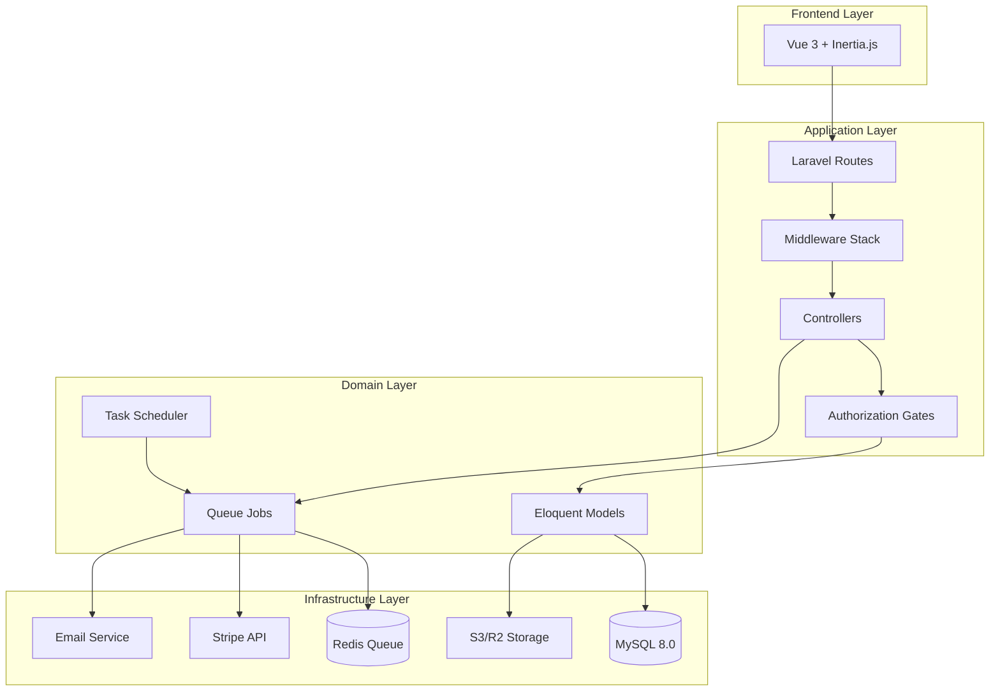
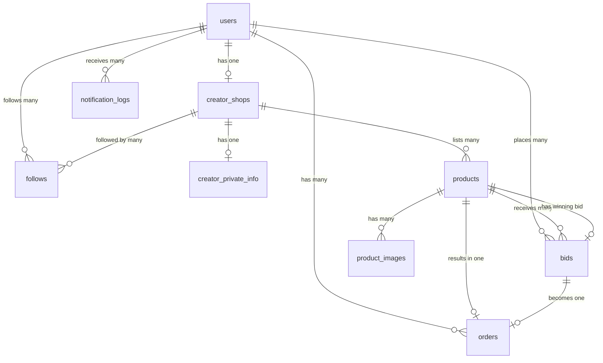

# Design Document: Creator Marketplace with Sealed Bid Auction

## Overview

The Creator Marketplace with Sealed Bid Auction is a Laravel 11 application that enables creators to sell products through time-bound sealed bid auctions. The system's core innovation is maintaining strict bid confidentiality while providing rank-based feedback to participants.

### Key Design Principles

1. **Bid Privacy by Default**: Sealed bid amounts are protected at multiple layers (database queries, gates, API responses)
2. **Multi-Layer Authorization**: Role-based middleware + gate-based authorization for sensitive operations
3. **Asynchronous Processing**: Background jobs for auction closing, notifications, and payment processing
4. **Separation of Concerns**: Public and private data are stored separately and loaded conditionally
5. **Fail-Safe Automation**: Laravel Scheduler with queued jobs ensures auctions close reliably

### System Boundaries

**In Scope:**
- Multi-role authentication (admin, creator, buyer)
- Creator onboarding and shop management
- Product listing with S3 image uploads
- Sealed bid submission and privacy enforcement
- Automated auction closing via scheduler
- Post-auction leaderboard (ranks only)
- Stripe payment processing via Cashier
- Follow system with personalized feeds
- Email notifications via queues

**Out of Scope:**
- Real-time bidding updates (WebSockets)
- Multi-currency support
- Shipping/fulfillment management
- Dispute resolution workflow
- Mobile native applications

## Architecture

### High-Level Architecture



### Technology Stack

**Frontend:**
- Vue 3 with Composition API
- Inertia.js for SPA-like experience without API layer
- TypeScript for type safety
- Tailwind CSS + shadcn/ui components

**Backend:**
- Laravel 11 (PHP 8.3)
- Laravel Breeze for authentication scaffolding
- Laravel Cashier for Stripe integration
- Laravel Queue with Redis driver
- Laravel Task Scheduling for auction automation

**Data Storage:**
- MySQL 8.0 for relational data
- Redis for queue management and caching
- S3 or Cloudflare R2 for file storage

**External Services:**
- Stripe for payment processing
- Mailtrap (dev) / Resend or Mailgun (prod) for email delivery

### Request Flow Patterns

**1. Public Marketplace Browse (Unauthenticated)**
```
Browser → Route → Controller → Model (public scope) → Inertia Response → Vue Component
```

**2. Sealed Bid Submission (Authenticated Buyer)**
```
Browser → Route → Middleware (auth, role:buyer) → Controller → Gate (can-bid) 
→ Validation → Model → DB → Response (rank only)
```

**3. Auction Closing (Scheduled)**
```
Scheduler (every minute) → CloseAuctionsCommand → Dispatch CloseAuctionJob 
→ Queue Worker → Determine Winner → Dispatch NotificationJobs → Email
```

**4. Payment Processing (Winner)**
```
Browser → Route → Middleware (auth, role:buyer) → Controller → Gate (can-pay) 
→ Stripe Cashier → Payment Intent → Webhook → CreateOrderJob → Notification
```

### Security Architecture

**Multi-Layer Bid Privacy:**
1. **Database Layer**: Query scopes exclude bid amounts by default
2. **Authorization Layer**: Gates enforce ownership checks before revealing amounts
3. **API Layer**: Inertia responses never include unauthorized bid amounts
4. **Frontend Layer**: Vue components conditionally render based on permissions

**Role-Based Access Control:**
- Middleware: `role:admin`, `role:creator`, `role:buyer`
- Custom middleware: `EnsureCreatorOnboarded`
- Gates: `view-bid-amount`, `manage-creator-shop`, `admin-dashboard`

## Components and Interfaces

### Core Models

**User Model**
```php
class User extends Authenticatable
{
    protected $fillable = ['name', 'email', 'password', 'role'];
    protected $casts = ['role' => UserRole::enum];
    
    // Relationships
    public function creatorShop(): HasOne;
    public function bids(): HasMany;
    public function follows(): BelongsToMany;
    public function orders(): HasMany;
    
    // Scopes
    public function scopeCreators(Builder $query): void;
    public function scopeBuyers(Builder $query): void;
}
```

**Product Model**
```php
class Product extends Model
{
    protected $keyType = 'string';
    public $incrementing = false;
    protected $fillable = ['title', 'description', 'reserve_price', 'auction_start', 'auction_end', 'status'];
    protected $casts = [
        'auction_start' => 'datetime',
        'auction_end' => 'datetime',
        'status' => AuctionStatus::enum,
        'reserve_price' => 'decimal:2'
    ];
    
    // Relationships
    public function creator(): BelongsTo;
    public function bids(): HasMany;
    public function images(): HasMany;
    
    // Scopes
    public function scopeActive(Builder $query): void;
    public function scopeEnded(Builder $query): void;
    public function scopeNeedsClosure(Builder $query): void;
    
    // Business Logic
    public function isActive(): bool;
    public function hasEnded(): bool;
    public function getWinningBid(): ?Bid;
}
```

**Bid Model**
```php
class Bid extends Model
{
    protected $keyType = 'string';
    public $incrementing = false;
    protected $fillable = ['product_id', 'user_id', 'amount'];
    protected $casts = ['amount' => 'decimal:2'];
    
    // Relationships
    public function product(): BelongsTo;
    public function user(): BelongsTo;
    
    // Scopes (CRITICAL for privacy)
    public function scopeForUser(Builder $query, User $user): void;
    public function scopeWithAmountIfAuthorized(Builder $query, User $user): void;
    
    // Business Logic
    public function getRank(): int;
    public function isWinning(): bool;
}
```

**CreatorShop Model**
```php
class CreatorShop extends Model
{
    protected $keyType = 'string';
    public $incrementing = false;
    protected $fillable = ['user_id', 'shop_name', 'bio', 'profile_image', 'banner_image', 'is_onboarded'];
    
    // Relationships
    public function creator(): BelongsTo;
    public function products(): HasMany;
    public function followers(): BelongsToMany;
    
    // Business Logic
    public function getFollowerCount(): int;
    public function getActiveProductCount(): int;
}
```

**CreatorPrivateInfo Model**
```php
class CreatorPrivateInfo extends Model
{
    protected $table = 'creator_private_info';
    protected $fillable = ['creator_shop_id', 'stripe_account_id', 'tax_id', 'payout_email'];
    protected $casts = ['tax_id' => 'encrypted'];
    
    // NEVER load this on public routes
    // Only accessible to creator owner and admins
}
```

### Controllers

**MarketplaceController**
```php
class MarketplaceController extends Controller
{
    public function index(Request $request): Response
    {
        // Open market feed with filters
        $products = Product::active()
            ->with(['creator.shop', 'images'])
            ->when($request->category, fn($q) => $q->where('category', $request->category))
            ->when($request->max_price, fn($q) => $q->where('reserve_price', '<=', $request->max_price))
            ->paginate(20);
            
        return Inertia::render('Marketplace/Index', ['products' => $products]);
    }
    
    public function forYou(Request $request): Response
    {
        // Personalized feed from followed creators
        $followedCreatorIds = $request->user()->follows()->pluck('creator_id');
        
        $products = Product::active()
            ->whereIn('creator_id', $followedCreatorIds)
            ->with(['creator.shop', 'images'])
            ->latest()
            ->paginate(20);
            
        return Inertia::render('Marketplace/ForYou', ['products' => $products]);
    }
}
```

**BidController**
```php
class BidController extends Controller
{
    public function store(StoreBidRequest $request, Product $product): RedirectResponse
    {
        Gate::authorize('place-bid', $product);
        
        $bid = Bid::updateOrCreate(
            ['product_id' => $product->id, 'user_id' => $request->user()->id],
            ['amount' => $request->amount]
        );
        
        // Return only rank, never amount to other users
        $rank = $bid->getRank();
        
        return redirect()->back()->with('success', "Your bid is currently ranked #{$rank}");
    }
    
    public function show(Product $product): Response
    {
        $userBid = Bid::where('product_id', $product->id)
            ->where('user_id', auth()->id())
            ->first();
            
        // Only show amount if authorized
        if ($userBid && Gate::allows('view-bid-amount', $userBid)) {
            $bidData = ['amount' => $userBid->amount, 'rank' => $userBid->getRank()];
        } else {
            $bidData = ['rank' => $userBid?->getRank()];
        }
        
        return Inertia::render('Bids/Show', ['bid' => $bidData]);
    }
}
```

**Admin/CreatorController**
```php
class Admin\CreatorController extends Controller
{
    public function __construct()
    {
        $this->middleware(['auth', 'role:admin']);
    }
    
    public function store(StoreCreatorRequest $request): RedirectResponse
    {
        $temporaryPassword = Str::random(16);
        
        $user = User::create([
            'name' => $request->name,
            'email' => $request->email,
            'password' => Hash::make($temporaryPassword),
            'role' => UserRole::Creator,
        ]);
        
        CreatorShop::create(['user_id' => $user->id, 'is_onboarded' => false]);
        
        // Queue invite email
        SendCreatorInviteEmail::dispatch($user, $temporaryPassword);
        
        return redirect()->route('admin.creators.index')->with('success', 'Creator invited');
    }
}
```

### Queue Jobs

**CloseAuctionJob**
```php
class CloseAuctionJob implements ShouldQueue
{
    use Dispatchable, InteractsWithQueue, Queueable, SerializesModels;
    
    public function __construct(public Product $product) {}
    
    public function handle(): void
    {
        DB::transaction(function () {
            $winningBid = $this->product->getWinningBid();
            
            if ($winningBid && $winningBid->amount >= $this->product->reserve_price) {
                $this->product->update(['status' => AuctionStatus::Sold, 'winning_bid_id' => $winningBid->id]);
                
                // Dispatch notifications
                SendAuctionWonEmail::dispatch($winningBid->user, $this->product);
                SendAuctionSoldEmail::dispatch($this->product->creator, $this->product);
            } else {
                $this->product->update(['status' => AuctionStatus::Unsold]);
            }
        });
    }
}
```

**ProcessPaymentJob**
```php
class ProcessPaymentJob implements ShouldQueue
{
    public function __construct(public Bid $bid, public string $paymentMethodId) {}
    
    public function handle(): void
    {
        $user = $this->bid->user;
        $product = $this->bid->product;
        
        // Create Stripe payment intent via Cashier
        $payment = $user->charge(
            $this->bid->amount * 100, // Convert to cents
            $this->paymentMethodId,
            ['description' => "Purchase: {$product->title}"]
        );
        
        // Create order record
        Order::create([
            'id' => Str::uuid(),
            'user_id' => $user->id,
            'product_id' => $product->id,
            'bid_id' => $this->bid->id,
            'amount' => $this->bid->amount,
            'stripe_payment_id' => $payment->id,
            'status' => OrderStatus::Completed,
        ]);
        
        // Transfer to creator (via Stripe Connect)
        $this->transferToCreator($product->creator, $this->bid->amount);
        
        // Send confirmations
        SendPaymentConfirmationEmail::dispatch($user, $product);
        SendSaleConfirmationEmail::dispatch($product->creator, $product);
    }
}
```

### Middleware

**EnsureCreatorOnboarded**
```php
class EnsureCreatorOnboarded
{
    public function handle(Request $request, Closure $next): Response
    {
        if ($request->user()->role === UserRole::Creator) {
            $shop = $request->user()->creatorShop;
            
            if (!$shop || !$shop->is_onboarded) {
                return redirect()->route('creator.onboarding');
            }
        }
        
        return $next($request);
    }
}
```

**RoleMiddleware**
```php
class RoleMiddleware
{
    public function handle(Request $request, Closure $next, string $role): Response
    {
        if ($request->user()->role->value !== $role) {
            abort(403, 'Unauthorized access');
        }
        
        return $next($request);
    }
}
```

### Authorization Gates

```php
// In AuthServiceProvider
Gate::define('view-bid-amount', function (User $user, Bid $bid) {
    return $user->id === $bid->user_id || $user->role === UserRole::Admin;
});

Gate::define('place-bid', function (User $user, Product $product) {
    return $user->role === UserRole::Buyer 
        && $product->isActive() 
        && !$product->hasEnded();
});

Gate::define('manage-creator-shop', function (User $user, CreatorShop $shop) {
    return $user->id === $shop->user_id || $user->role === UserRole::Admin;
});

Gate::define('admin-dashboard', function (User $user) {
    return $user->role === UserRole::Admin;
});
```

### Scheduled Tasks

```php
// In app/Console/Kernel.php or routes/console.php
Schedule::command('auctions:close')->everyMinute();
```

**CloseAuctionsCommand**
```php
class CloseAuctionsCommand extends Command
{
    protected $signature = 'auctions:close';
    protected $description = 'Close auctions that have ended';
    
    public function handle(): void
    {
        $endedAuctions = Product::needsClosure()->get();
        
        foreach ($endedAuctions as $product) {
            CloseAuctionJob::dispatch($product);
        }
        
        $this->info("Dispatched {$endedAuctions->count()} auction closure jobs");
    }
}
```

## Data Models

### Database Schema

**users table**
```sql
CREATE TABLE users (
    id CHAR(36) PRIMARY KEY,
    name VARCHAR(255) NOT NULL,
    email VARCHAR(255) UNIQUE NOT NULL,
    password VARCHAR(255) NOT NULL,
    role ENUM('admin', 'creator', 'buyer') NOT NULL DEFAULT 'buyer',
    email_verified_at TIMESTAMP NULL,
    remember_token VARCHAR(100) NULL,
    created_at TIMESTAMP DEFAULT CURRENT_TIMESTAMP,
    updated_at TIMESTAMP DEFAULT CURRENT_TIMESTAMP ON UPDATE CURRENT_TIMESTAMP,
    deleted_at TIMESTAMP NULL,
    INDEX idx_role (role),
    INDEX idx_email (email)
) ENGINE=InnoDB DEFAULT CHARSET=utf8mb4 COLLATE=utf8mb4_unicode_ci;
```

**creator_shops table**
```sql
CREATE TABLE creator_shops (
    id CHAR(36) PRIMARY KEY,
    user_id CHAR(36) UNIQUE NOT NULL,
    shop_name VARCHAR(255) NOT NULL,
    bio TEXT NULL,
    profile_image VARCHAR(500) NULL,
    banner_image VARCHAR(500) NULL,
    is_onboarded BOOLEAN DEFAULT FALSE,
    created_at TIMESTAMP DEFAULT CURRENT_TIMESTAMP,
    updated_at TIMESTAMP DEFAULT CURRENT_TIMESTAMP ON UPDATE CURRENT_TIMESTAMP,
    FOREIGN KEY (user_id) REFERENCES users(id) ON DELETE CASCADE,
    INDEX idx_user_id (user_id),
    INDEX idx_onboarded (is_onboarded)
) ENGINE=InnoDB DEFAULT CHARSET=utf8mb4 COLLATE=utf8mb4_unicode_ci;
```

**creator_private_info table**
```sql
CREATE TABLE creator_private_info (
    id CHAR(36) PRIMARY KEY,
    creator_shop_id CHAR(36) UNIQUE NOT NULL,
    stripe_account_id VARCHAR(255) NULL,
    tax_id TEXT NULL, -- Encrypted
    payout_email VARCHAR(255) NULL,
    created_at TIMESTAMP DEFAULT CURRENT_TIMESTAMP,
    updated_at TIMESTAMP DEFAULT CURRENT_TIMESTAMP ON UPDATE CURRENT_TIMESTAMP,
    FOREIGN KEY (creator_shop_id) REFERENCES creator_shops(id) ON DELETE CASCADE,
    INDEX idx_creator_shop_id (creator_shop_id)
) ENGINE=InnoDB DEFAULT CHARSET=utf8mb4 COLLATE=utf8mb4_unicode_ci;
```

**products table**
```sql
CREATE TABLE products (
    id CHAR(36) PRIMARY KEY,
    creator_id CHAR(36) NOT NULL,
    title VARCHAR(255) NOT NULL,
    description TEXT NOT NULL,
    category VARCHAR(100) NULL,
    reserve_price DECIMAL(10, 2) NOT NULL,
    auction_start TIMESTAMP NOT NULL,
    auction_end TIMESTAMP NOT NULL,
    status ENUM('draft', 'active', 'ended', 'sold', 'unsold') NOT NULL DEFAULT 'draft',
    winning_bid_id CHAR(36) NULL,
    created_at TIMESTAMP DEFAULT CURRENT_TIMESTAMP,
    updated_at TIMESTAMP DEFAULT CURRENT_TIMESTAMP ON UPDATE CURRENT_TIMESTAMP,
    deleted_at TIMESTAMP NULL,
    FOREIGN KEY (creator_id) REFERENCES users(id) ON DELETE CASCADE,
    FOREIGN KEY (winning_bid_id) REFERENCES bids(id) ON DELETE SET NULL,
    INDEX idx_creator_id (creator_id),
    INDEX idx_auction_end (auction_end),
    INDEX idx_status (status),
    INDEX idx_category (category),
    CONSTRAINT chk_auction_times CHECK (auction_end > auction_start)
) ENGINE=InnoDB DEFAULT CHARSET=utf8mb4 COLLATE=utf8mb4_unicode_ci;
```

**product_images table**
```sql
CREATE TABLE product_images (
    id CHAR(36) PRIMARY KEY,
    product_id CHAR(36) NOT NULL,
    image_path VARCHAR(500) NOT NULL,
    is_primary BOOLEAN DEFAULT FALSE,
    display_order INT DEFAULT 0,
    created_at TIMESTAMP DEFAULT CURRENT_TIMESTAMP,
    FOREIGN KEY (product_id) REFERENCES products(id) ON DELETE CASCADE,
    INDEX idx_product_id (product_id)
) ENGINE=InnoDB DEFAULT CHARSET=utf8mb4 COLLATE=utf8mb4_unicode_ci;
```

**bids table**
```sql
CREATE TABLE bids (
    id CHAR(36) PRIMARY KEY,
    product_id CHAR(36) NOT NULL,
    user_id CHAR(36) NOT NULL,
    amount DECIMAL(10, 2) NOT NULL,
    created_at TIMESTAMP DEFAULT CURRENT_TIMESTAMP,
    updated_at TIMESTAMP DEFAULT CURRENT_TIMESTAMP ON UPDATE CURRENT_TIMESTAMP,
    FOREIGN KEY (product_id) REFERENCES products(id) ON DELETE CASCADE,
    FOREIGN KEY (user_id) REFERENCES users(id) ON DELETE CASCADE,
    UNIQUE KEY unique_user_product_bid (user_id, product_id),
    INDEX idx_product_id (product_id),
    INDEX idx_user_id (user_id),
    INDEX idx_amount (amount)
) ENGINE=InnoDB DEFAULT CHARSET=utf8mb4 COLLATE=utf8mb4_unicode_ci;
```

**follows table**
```sql
CREATE TABLE follows (
    id CHAR(36) PRIMARY KEY,
    follower_id CHAR(36) NOT NULL,
    creator_id CHAR(36) NOT NULL,
    created_at TIMESTAMP DEFAULT CURRENT_TIMESTAMP,
    FOREIGN KEY (follower_id) REFERENCES users(id) ON DELETE CASCADE,
    FOREIGN KEY (creator_id) REFERENCES users(id) ON DELETE CASCADE,
    UNIQUE KEY unique_follow (follower_id, creator_id),
    INDEX idx_follower_id (follower_id),
    INDEX idx_creator_id (creator_id)
) ENGINE=InnoDB DEFAULT CHARSET=utf8mb4 COLLATE=utf8mb4_unicode_ci;
```

**orders table**
```sql
CREATE TABLE orders (
    id CHAR(36) PRIMARY KEY,
    user_id CHAR(36) NOT NULL,
    product_id CHAR(36) NOT NULL,
    bid_id CHAR(36) NOT NULL,
    amount DECIMAL(10, 2) NOT NULL,
    stripe_payment_id VARCHAR(255) NOT NULL,
    status ENUM('pending', 'completed', 'expired', 'refunded') NOT NULL DEFAULT 'pending',
    payment_deadline TIMESTAMP NULL,
    created_at TIMESTAMP DEFAULT CURRENT_TIMESTAMP,
    updated_at TIMESTAMP DEFAULT CURRENT_TIMESTAMP ON UPDATE CURRENT_TIMESTAMP,
    deleted_at TIMESTAMP NULL,
    FOREIGN KEY (user_id) REFERENCES users(id) ON DELETE CASCADE,
    FOREIGN KEY (product_id) REFERENCES products(id) ON DELETE CASCADE,
    FOREIGN KEY (bid_id) REFERENCES bids(id) ON DELETE CASCADE,
    INDEX idx_user_id (user_id),
    INDEX idx_product_id (product_id),
    INDEX idx_status (status),
    INDEX idx_payment_deadline (payment_deadline)
) ENGINE=InnoDB DEFAULT CHARSET=utf8mb4 COLLATE=utf8mb4_unicode_ci;
```

**notification_logs table**
```sql
CREATE TABLE notification_logs (
    id CHAR(36) PRIMARY KEY,
    user_id CHAR(36) NOT NULL,
    type VARCHAR(100) NOT NULL,
    subject VARCHAR(255) NOT NULL,
    sent_at TIMESTAMP DEFAULT CURRENT_TIMESTAMP,
    FOREIGN KEY (user_id) REFERENCES users(id) ON DELETE CASCADE,
    INDEX idx_user_id (user_id),
    INDEX idx_type (type),
    INDEX idx_sent_at (sent_at)
) ENGINE=InnoDB DEFAULT CHARSET=utf8mb4 COLLATE=utf8mb4_unicode_ci;
```

### Entity Relationships



### Enums

**UserRole**
```php
enum UserRole: string
{
    case Admin = 'admin';
    case Creator = 'creator';
    case Buyer = 'buyer';
}
```

**AuctionStatus**
```php
enum AuctionStatus: string
{
    case Draft = 'draft';
    case Active = 'active';
    case Ended = 'ended';
    case Sold = 'sold';
    case Unsold = 'unsold';
}
```

**OrderStatus**
```php
enum OrderStatus: string
{
    case Pending = 'pending';
    case Completed = 'completed';
    case Expired = 'expired';
    case Refunded = 'refunded';
}
```

### Data Validation Rules

**Product Creation**
```php
[
    'title' => 'required|string|max:255',
    'description' => 'required|string|max:5000',
    'category' => 'nullable|string|max:100',
    'reserve_price' => 'required|numeric|min:0.01|max:999999.99',
    'auction_start' => 'required|date|after:now',
    'auction_end' => 'required|date|after:auction_start',
    'images' => 'required|array|min:1|max:5',
    'images.*' => 'image|mimes:jpeg,png,jpg,webp|max:5120', // 5MB
]
```

**Bid Submission**
```php
[
    'amount' => 'required|numeric|min:0.01|gte:reserve_price',
]
```

**Creator Shop Setup**
```php
[
    'shop_name' => 'required|string|max:255|unique:creator_shops,shop_name',
    'bio' => 'nullable|string|max:1000',
    'profile_image' => 'nullable|image|mimes:jpeg,png,jpg|max:2048', // 2MB
    'banner_image' => 'nullable|image|mimes:jpeg,png,jpg,webp|max:5120', // 5MB
]
```


## Correctness Properties

*A property is a characteristic or behavior that should hold true across all valid executions of a system—essentially, a formal statement about what the system should do. Properties serve as the bridge between human-readable specifications and machine-verifiable correctness guarantees.*

### Property 1: Role-Based Route Protection

*For any* protected route and any user without the required role, access should be denied and the user should be redirected to an appropriate page.

**Validates: Requirements 1.4, 14.5**

### Property 2: Secure Password Generation

*For any* creator account creation, the system should generate a temporary password that meets security criteria (minimum length, character variety).

**Validates: Requirements 2.2**

### Property 3: Creator Invite Email Queuing

*For any* creator account creation, an invite email with login credentials should be queued for delivery.

**Validates: Requirements 2.3**

### Property 4: Non-Onboarded Creator Access Restriction

*For any* creator who has not completed onboarding, access to protected creator features should be blocked.

**Validates: Requirements 3.2**

### Property 5: Onboarding Completion State Transition

*For any* creator completing the onboarding flow, their account should be marked as active (is_onboarded = true).

**Validates: Requirements 3.5**

### Property 6: Creator Private Info Encryption

*For any* creator private information (tax_id, payout details), the data should be encrypted when stored in the database.

**Validates: Requirements 4.2, 16.2**

### Property 7: Private Info Exclusion on Public Routes

*For any* public route (marketplace, shop pages), Creator_Private_Info should never be loaded or exposed in the response.

**Validates: Requirements 4.3, 12.5**

### Property 8: Shop Information Validation

*For any* creator shop update with invalid data (e.g., shop_name exceeding max length, invalid email format), the update should be rejected with validation errors.

**Validates: Requirements 4.4**

### Property 9: File Upload Validation

*For any* file upload, files that fail validation (invalid type, exceeds size limit, or contains malicious content) should be rejected with descriptive error messages.

**Validates: Requirements 5.2, 16.4, 17.1, 17.2, 17.3, 17.4, 17.5**

### Property 10: Auction Time Constraint

*For any* product creation or update, if the auction end time is not after the start time, the operation should be rejected.

**Validates: Requirements 5.6**

### Property 11: Marketplace Filter Accuracy

*For any* filter applied to the marketplace (category, price range, end time), all returned products should match the filter criteria.

**Validates: Requirements 6.2**

### Property 12: Reserve Price Privacy During Active Auction

*For any* active auction, the reserve price should not be visible to buyers (only to creator and admin).

**Validates: Requirements 6.5**

### Property 13: Bid Storage and Uniqueness

*For any* bid submission by a buyer on a product, the bid should be stored in the database, and only one bid per buyer-product pair should exist.

**Validates: Requirements 7.1, 7.2**

### Property 14: Bid Update on Resubmission

*For any* buyer submitting a second bid on the same product, the existing bid should be updated (not duplicated), and the new amount should replace the old amount.

**Validates: Requirements 7.3**

### Property 15: Bid Amount Validation

*For any* bid submission, if the bid amount is less than the reserve price, the bid should be rejected with a validation error.

**Validates: Requirements 7.5**

### Property 16: Post-Auction Bid Prevention

*For any* auction that has ended, bid submissions should be rejected with an appropriate error message.

**Validates: Requirements 7.6**

### Property 17: Sealed Bid Privacy

*For any* bid and any user who is not the bid owner or an admin, the bid amount should never be visible in API responses, leaderboards, or UI components.

**Validates: Requirements 7.7, 8.2, 8.4, 8.5, 10.4, 16.6**

### Property 18: Automated Auction Closing

*For any* auction whose end time has passed, the auction scheduler should close the auction and update its status.

**Validates: Requirements 9.2**

### Property 19: Winner Determination

*For any* closed auction with bids, the bid with the highest amount should be determined as the winning bid.

**Validates: Requirements 9.4**

### Property 20: Unsold Auction Handling

*For any* closed auction where no bid meets or exceeds the reserve price, the auction should be marked as "unsold" with no winner.

**Validates: Requirements 9.5**

### Property 21: Auction Close Notifications

*For any* auction that closes with a winner, email notifications should be queued for both the winning buyer and the creator.

**Validates: Requirements 9.6, 15.1**

### Property 22: Leaderboard Rank Generation

*For any* closed auction with multiple bids, all bidders should be assigned a rank (1st, 2nd, 3rd, etc.) based on their bid amounts in descending order.

**Validates: Requirements 10.1, 10.3**

### Property 23: Payment Link Generation with Deadline

*For any* auction winner, a payment link should be generated with a deadline of 48 hours from auction close.

**Validates: Requirements 11.1**

### Property 24: Order Creation on Payment Completion

*For any* completed payment, an Order record should be created with the correct buyer, product, bid, and amount information.

**Validates: Requirements 11.3**

### Property 25: Payment Confirmation Notifications

*For any* completed payment, confirmation emails should be queued for both the buyer and the creator.

**Validates: Requirements 11.4, 15.2**

### Property 26: Order Expiration

*For any* order where payment is not completed within 48 hours, the order status should be updated to "expired".

**Validates: Requirements 11.5**

### Property 27: Fund Transfer to Creator

*For any* successful payment, funds (minus platform fees) should be transferred to the creator's Stripe Connect account.

**Validates: Requirements 11.6**

### Property 28: Follower Count Accuracy

*For any* creator shop, the displayed follower count should equal the number of follow relationships in the database for that creator.

**Validates: Requirements 12.4**

### Property 29: Personalized Feed Filtering

*For any* buyer viewing their For_You_Feed, only products from creators they follow should be displayed.

**Validates: Requirements 13.3**

### Property 30: Admin Bid Visibility

*For any* admin user, all bid amounts for any auction should be visible in the admin dashboard.

**Validates: Requirements 14.2**

### Property 31: Auction Statistics Accuracy

*For any* auction, the displayed statistics (total bids, highest bid, average bid) should accurately reflect the actual bid data.

**Validates: Requirements 14.3**

### Property 32: New Product Follower Notifications

*For any* new product listed by a creator, notification emails should be queued for all followers of that creator.

**Validates: Requirements 15.3**

### Property 33: Notification Logging

*For any* notification email sent, a record should be created in the notification_logs table with the correct user, type, and timestamp.

**Validates: Requirements 15.4**

### Property 34: Job Retry Logic

*For any* queued job that fails, the system should retry the job up to 3 times before marking it as permanently failed.

**Validates: Requirements 19.5**

### Property 35: Auction Data Serialization Round-Trip

*For any* valid Auction object, serializing to JSON then parsing back to an object should produce an equivalent Auction object (all fields preserved).

**Validates: Requirements 20.1, 20.2, 20.4, 20.5**

### Property 36: Invalid JSON Error Handling

*For any* invalid JSON input to the auction parser, the system should return a descriptive error message without crashing.

**Validates: Requirements 20.3**

## Error Handling

### Error Categories

**1. Validation Errors (400 Bad Request)**
- Invalid bid amount (below reserve price)
- Invalid auction times (end before start)
- Invalid file uploads (wrong type, too large)
- Missing required fields
- Invalid data formats

**Response Format:**
```json
{
  "message": "The given data was invalid.",
  "errors": {
    "field_name": ["Specific error message"]
  }
}
```

**2. Authorization Errors (403 Forbidden)**
- Non-admin accessing admin dashboard
- Buyer attempting to view other buyers' bid amounts
- Non-creator accessing creator features
- Accessing routes without proper role

**Response Format:**
```json
{
  "message": "Unauthorized access"
}
```

**3. Authentication Errors (401 Unauthorized)**
- Unauthenticated user accessing protected routes
- Invalid or expired session

**Response Format:**
```json
{
  "message": "Unauthenticated"
}
```

**4. Not Found Errors (404 Not Found)**
- Product does not exist
- Creator shop not found
- Bid not found

**Response Format:**
```json
{
  "message": "Resource not found"
}
```

**5. Business Logic Errors (422 Unprocessable Entity)**
- Bidding on ended auction
- Submitting bid below reserve price
- Payment after deadline expired
- Creator not onboarded attempting to create product

**Response Format:**
```json
{
  "message": "Cannot process request",
  "reason": "Specific business rule violation"
}
```

**6. Rate Limit Errors (429 Too Many Requests)**
- Excessive bid submissions
- Too many API requests

**Response Format:**
```json
{
  "message": "Too many requests",
  "retry_after": 60
}
```

**7. Server Errors (500 Internal Server Error)**
- Database connection failures
- External service failures (Stripe, S3, email)
- Unexpected exceptions

**Response Format:**
```json
{
  "message": "An error occurred. Please try again later."
}
```

### Error Handling Strategies

**Database Transactions:**
- Wrap critical operations (auction closing, payment processing) in database transactions
- Rollback on any failure to maintain data consistency

**Queue Job Failures:**
- Retry failed jobs up to 3 times with exponential backoff
- Log failures to `failed_jobs` table for manual review
- Send admin alerts for critical job failures (payment processing, auction closing)

**External Service Failures:**
- Stripe API failures: Retry with exponential backoff, log for manual processing
- S3 upload failures: Return user-friendly error, allow retry
- Email delivery failures: Queue for retry, log for monitoring

**Graceful Degradation:**
- If leaderboard calculation fails, show basic auction results
- If follower count query fails, hide count rather than breaking page
- If image loading fails, show placeholder image

**Logging Strategy:**
- Log all errors to Laravel log files with context (user ID, request data)
- Use different log levels: ERROR for failures, WARNING for retryable issues, INFO for business events
- Integrate with monitoring service (e.g., Sentry) for production error tracking

## Testing Strategy

### Dual Testing Approach

The system will employ both unit testing and property-based testing to ensure comprehensive coverage:

**Unit Tests:**
- Specific examples demonstrating correct behavior
- Edge cases and boundary conditions
- Integration points between components
- Error conditions and exception handling
- Specific user flows (e.g., creator onboarding, payment completion)

**Property-Based Tests:**
- Universal properties that hold for all inputs
- Comprehensive input coverage through randomization
- Validation of business rules across many scenarios
- Security properties (bid privacy, authorization)
- Data integrity properties (serialization, database constraints)

### Property-Based Testing Configuration

**Library:** [PestPHP Property Testing](https://pestphp.com/docs/plugins#property-testing) or [PHPUnit with Eris](https://github.com/giorgiosironi/eris)

**Configuration:**
- Minimum 100 iterations per property test
- Each property test must reference its design document property
- Tag format: `@test Feature: creator-marketplace-sealed-bid-auction, Property {number}: {property_text}`

**Example Property Test:**
```php
/**
 * @test
 * Feature: creator-marketplace-sealed-bid-auction, Property 17: Sealed Bid Privacy
 */
it('never exposes bid amounts to unauthorized users', function () {
    forAll(
        Generator\user(['role' => 'buyer']),
        Generator\product(),
        Generator\bid()
    )->then(function ($unauthorizedUser, $product, $bid) {
        actingAs($unauthorizedUser);
        
        $response = get(route('products.show', $product));
        
        // Bid amount should not appear in response
        expect($response->json())->not->toContain($bid->amount);
        
        // Only rank should be visible
        if ($bid->user_id === $unauthorizedUser->id) {
            expect($response->json())->toHaveKey('rank');
        }
    });
})->repeat(100);
```

### Unit Testing Strategy

**Model Tests:**
- Test relationships (User has CreatorShop, Product has Bids)
- Test scopes (active auctions, ended auctions)
- Test business logic methods (getWinningBid, getRank, isActive)

**Controller Tests:**
- Test route access with different roles
- Test successful operations (create product, submit bid)
- Test validation failures
- Test authorization failures

**Job Tests:**
- Test CloseAuctionJob with various auction states
- Test ProcessPaymentJob with successful and failed payments
- Test notification jobs

**Integration Tests:**
- Test complete user flows (creator onboarding → product creation → auction → payment)
- Test Stripe integration with test mode
- Test S3 upload with fake storage
- Test email sending with Mail::fake()

### Test Data Generators

**For Property-Based Tests:**
```php
class Generator
{
    public static function user(array $attributes = []): Gen
    {
        return Gen\map(
            fn($name, $email, $role) => User::factory()->create([
                'name' => $name,
                'email' => $email,
                'role' => $role,
                ...$attributes
            ]),
            Gen\names(),
            Gen\emails(),
            Gen\elements(UserRole::cases())
        );
    }
    
    public static function product(): Gen
    {
        return Gen\map(
            fn($title, $price, $start, $end) => Product::factory()->create([
                'title' => $title,
                'reserve_price' => $price,
                'auction_start' => $start,
                'auction_end' => $end,
            ]),
            Gen\string(),
            Gen\choose(1, 10000),
            Gen\date(),
            Gen\date()
        )->suchThat(fn($p) => $p->auction_end > $p->auction_start);
    }
    
    public static function bid(): Gen
    {
        return Gen\map(
            fn($product, $user, $amount) => Bid::factory()->create([
                'product_id' => $product->id,
                'user_id' => $user->id,
                'amount' => $amount,
            ]),
            self::product(),
            self::user(['role' => 'buyer']),
            Gen\choose(1, 10000)
        );
    }
}
```

### Coverage Goals

- **Line Coverage:** Minimum 80% for application code
- **Branch Coverage:** Minimum 75% for conditional logic
- **Property Coverage:** 100% of correctness properties must have corresponding property tests
- **Critical Path Coverage:** 100% for bid privacy, payment processing, and auction closing

### Continuous Integration

- Run full test suite on every pull request
- Run property tests with 100 iterations in CI
- Run extended property tests (1000 iterations) nightly
- Block merges if tests fail or coverage drops below threshold
- Generate coverage reports and track trends over time

