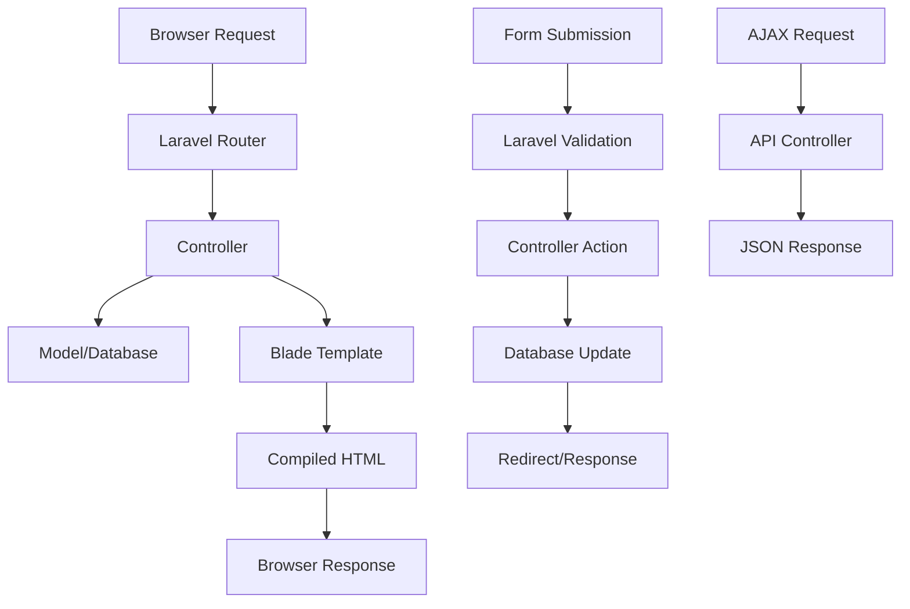
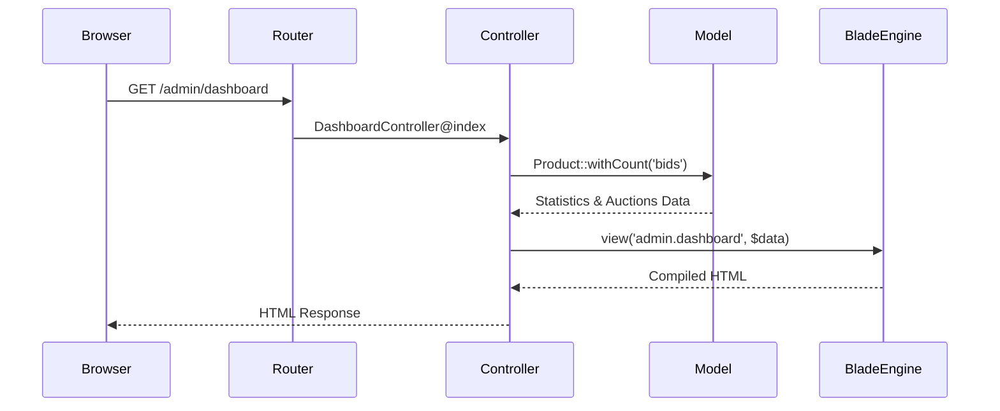
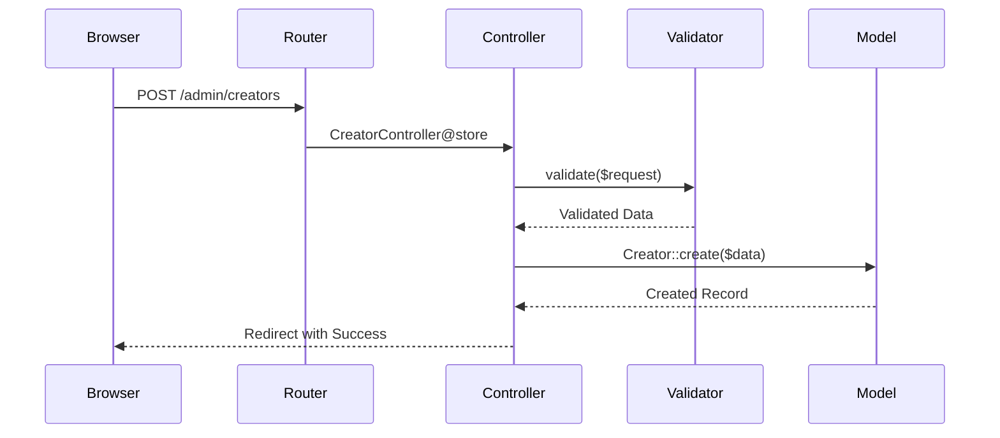

# Design Document: Frontend Blade Conversion

## Overview

This design outlines the conversion of a Laravel application from a Node.js/React frontend using Inertia.js to traditional PHP Blade templates. The current setup uses React components with shadcn/ui styling, TypeScript, and client-side routing through Inertia.js. The conversion will maintain all existing functionality while transitioning to server-side rendering with Blade templates, traditional form submissions, and PHP-based data handling.

## Architecture



## Sequence Diagrams

### Main Page Flow


### Form Submission Flow


## Components and Interfaces

### Blade Layout System

**Purpose**: Provide consistent page structure and shared components

**Main Layout Interface**:
```php
// resources/views/layouts/app.blade.php
@props([
    'title' => config('app.name'),
    'bodyClass' => '',
    'scripts' => [],
    'styles' => []
])

<!DOCTYPE html>
<html lang="{{ str_replace('_', '-', app()->getLocale()) }}">
<head>
    <meta charset="utf-8">
    <meta name="viewport" content="width=device-width, initial-scale=1">
    <title>{{ $title }}</title>
    @vite(['resources/css/app.css'])
    @stack('styles')
</head>
<body class="{{ $bodyClass }}">
    {{ $slot }}
    @stack('scripts')
</body>
</html>
```

**Responsibilities**:
- Provide consistent HTML structure
- Include global CSS and JavaScript
- Handle meta tags and SEO
- Manage page-specific assets

### Component System

**Purpose**: Replace React components with Blade components

**Button Component Interface**:
```php
// resources/views/components/ui/button.blade.php
@props([
    'variant' => 'default',
    'size' => 'default',
    'type' => 'button',
    'disabled' => false,
    'href' => null
])

@php
$classes = match($variant) {
    'secondary' => 'bg-gray-100 text-gray-900 hover:bg-gray-200',
    'outline' => 'border border-gray-300 bg-white text-gray-700 hover:bg-gray-50',
    'destructive' => 'bg-red-600 text-white hover:bg-red-700',
    'ghost' => 'text-gray-700 hover:bg-gray-100',
    'link' => 'text-blue-600 underline hover:text-blue-800',
    default => 'bg-blue-600 text-white hover:bg-blue-700'
};

$sizeClasses = match($size) {
    'sm' => 'px-3 py-1.5 text-sm',
    'lg' => 'px-6 py-3 text-lg',
    default => 'px-4 py-2'
};
@endphp

@if($href)
    <a href="{{ $href }}" class="inline-flex items-center justify-center rounded-md font-medium transition-colors {{ $classes }} {{ $sizeClasses }} {{ $attributes->get('class') }}" {{ $attributes->except(['class', 'href']) }}>
        {{ $slot }}
    </a>
@else
    <button type="{{ $type }}" @if($disabled) disabled @endif class="inline-flex items-center justify-center rounded-md font-medium transition-colors {{ $classes }} {{ $sizeClasses }} {{ $attributes->get('class') }}" {{ $attributes->except(['class', 'type', 'disabled']) }}>
        {{ $slot }}
    </button>
@endif
```

**Card Component Interface**:
```php
// resources/views/components/ui/card.blade.php
@props(['class' => ''])

<div class="bg-white shadow rounded-lg {{ $class }}" {{ $attributes }}>
    {{ $slot }}
</div>

// resources/views/components/ui/card-header.blade.php
<div class="px-6 py-4 border-b border-gray-200" {{ $attributes }}>
    {{ $slot }}
</div>

// resources/views/components/ui/card-content.blade.php
<div class="px-6 py-4" {{ $attributes }}>
    {{ $slot }}
</div>
```

## Data Models

### Controller Data Structure

```php
interface DashboardData {
    statistics: array {
        total_auctions: int,
        active_auctions: int,
        sold_auctions: int,
        unsold_auctions: int
    },
    auctions: LengthAwarePaginator {
        data: Collection<Product>,
        current_page: int,
        last_page: int,
        per_page: int,
        total: int
    }
}

interface ProductData {
    id: string,
    title: string,
    status: string,
    auction_end: string,
    bids_count: int,
    highest_bid: float|null,
    creator: User {
        creator_shop: CreatorShop {
            shop_name: string
        }
    },
    images: Collection<ProductImage> {
        image_path: string,
        is_primary: boolean
    }
}
```

**Validation Rules**:
- All data must be sanitized before output
- Dates must be formatted consistently
- Currency values must be formatted with proper precision
- Image paths must be validated and secured

### Form Data Models

```php
interface CreatorFormData {
    name: string,
    email: string,
    shop_name: string,
    description: string|null
}

interface AuctionFilterData {
    status: string|null,
    from_date: string|null,
    to_date: string|null,
    limit: int
}
```

## Algorithmic Pseudocode

### Main Dashboard Rendering Algorithm

```pascal
ALGORITHM renderDashboard()
INPUT: authenticated admin user
OUTPUT: rendered dashboard HTML

BEGIN
  ASSERT user.hasRole('admin') = true
  
  // Step 1: Gather statistics
  statistics ← calculateAuctionStatistics()
  
  // Step 2: Fetch paginated auctions with relationships
  auctions ← Product.withCount('bids')
    .with(['creator.creatorShop', 'images'])
    .addSelect(['highest_bid' ← MAX(bids.amount)])
    .latest()
    .paginate(20)
  
  // Step 3: Prepare view data
  viewData ← {
    statistics: statistics,
    auctions: auctions,
    title: 'Admin Dashboard'
  }
  
  // Step 4: Render Blade template
  html ← BladeEngine.render('admin.dashboard', viewData)
  
  ASSERT html.isValid() AND html.contains('dashboard-content')
  
  RETURN html
END
```

**Preconditions:**
- User is authenticated and has admin role
- Database connection is available
- Blade templates exist and are valid

**Postconditions:**
- Returns valid HTML response
- All data is properly escaped for XSS protection
- Page includes all required statistics and auction data

**Loop Invariants:**
- All database queries maintain data integrity
- Each auction record includes required relationships

### Form Processing Algorithm

```pascal
ALGORITHM processCreatorForm(request)
INPUT: HTTP request with form data
OUTPUT: redirect response with status

BEGIN
  ASSERT request.method = 'POST'
  
  // Step 1: Validate input data
  validatedData ← validateCreatorData(request.all())
  
  IF validation.fails() THEN
    RETURN redirect.back().withErrors(validation.errors())
  END IF
  
  // Step 2: Create creator record
  TRY
    creator ← Creator.create(validatedData)
    
    // Step 3: Send notification email
    Mail.send(CreatorInviteMail, creator)
    
    // Step 4: Return success response
    RETURN redirect.route('admin.creators.index')
      .with('success', 'Creator invited successfully')
      
  CATCH DatabaseException e
    RETURN redirect.back()
      .withInput()
      .withErrors(['error' ← 'Failed to create creator'])
  END TRY
END
```

**Preconditions:**
- Request contains valid form data
- User has permission to create creators
- Email service is configured

**Postconditions:**
- Creator record is created or error is returned
- User receives appropriate feedback
- Form data is preserved on validation errors

**Loop Invariants:** N/A (no loops in this algorithm)

### AJAX Response Algorithm

```pascal
ALGORITHM handleAjaxExport(request, productId)
INPUT: AJAX request, optional product ID
OUTPUT: JSON response

BEGIN
  ASSERT request.isAjax() = true
  
  // Step 1: Determine export scope
  IF productId IS NOT NULL THEN
    // Single product export
    product ← Product.with(['creator', 'bids', 'images'])
      .findOrFail(productId)
    
    response ← {
      auction: product.toExportArray(),
      exported_at: now().toIso8601String()
    }
  ELSE
    // Multiple products export with filters
    query ← Product.with(['creator', 'bids', 'images'])
    
    // Apply filters from request
    FOR each filter IN request.filters DO
      query ← query.where(filter.field, filter.operator, filter.value)
    END FOR
    
    products ← query.latest().limit(min(request.limit, 1000)).get()
    
    response ← {
      auctions: products.map(product ← product.toExportArray()),
      total: products.count(),
      exported_at: now().toIso8601String()
    }
  END IF
  
  RETURN JsonResponse(response, 200)
END
```

**Preconditions:**
- Request is valid AJAX request
- User has export permissions
- Product exists if productId provided

**Postconditions:**
- Returns valid JSON response
- Data is properly formatted for export
- Response includes metadata (timestamp, count)

**Loop Invariants:**
- All exported products contain required relationships
- Filter application maintains query integrity

## Key Functions with Formal Specifications

### Function 1: convertInertiaController()

```php
function convertInertiaController(Controller $controller): Controller
```

**Preconditions:**
- `$controller` uses Inertia::render() for responses
- Controller methods return Inertia\Response objects
- All required Blade templates exist

**Postconditions:**
- Controller returns view() responses instead of Inertia::render()
- All data passed to views is properly structured
- No Inertia dependencies remain in controller

**Loop Invariants:** N/A (single transformation operation)

### Function 2: createBladeComponent()

```php
function createBladeComponent(string $componentName, array $props): string
```

**Preconditions:**
- `$componentName` is valid Blade component name
- `$props` contains all required component properties
- Component template exists in resources/views/components/

**Postconditions:**
- Returns valid Blade component markup
- All props are properly escaped for security
- Component follows established design patterns

**Loop Invariants:**
- For prop validation loops: All processed props are valid and safe

### Function 3: handleFormSubmission()

```php
function handleFormSubmission(Request $request, string $action): RedirectResponse
```

**Preconditions:**
- `$request` contains valid form data
- `$action` is supported form action
- User has required permissions for action

**Postconditions:**
- Returns appropriate redirect response
- Database is updated if validation passes
- User receives feedback message (success or error)

**Loop Invariants:**
- For validation loops: All rules are applied consistently
- For data processing loops: Data integrity is maintained

## Example Usage

### Dashboard Page Implementation

```php
// Controller
class DashboardController extends Controller
{
    public function index()
    {
        $statistics = [
            'total_auctions' => Product::count(),
            'active_auctions' => Product::where('status', 'active')->count(),
            'sold_auctions' => Product::where('status', 'sold')->count(),
            'unsold_auctions' => Product::where('status', 'unsold')->count(),
        ];

        $auctions = Product::withCount('bids')
            ->with(['creator.creatorShop', 'images'])
            ->addSelect([
                'highest_bid' => DB::table('bids')
                    ->selectRaw('MAX(amount)')
                    ->whereColumn('product_id', 'products.id')
            ])
            ->latest()
            ->paginate(20);

        return view('admin.dashboard', compact('statistics', 'auctions'));
    }
}
```

```blade
{{-- Blade Template --}}
@extends('layouts.app')

@section('title', 'Admin Dashboard')

@section('content')
<div class="py-12">
    <div class="max-w-7xl mx-auto sm:px-6 lg:px-8 space-y-6">
        <div class="flex justify-between items-center">
            <h1 class="text-3xl font-bold">Admin Dashboard</h1>
            <x-ui.button href="{{ route('admin.auctions.export') }}" variant="outline">
                Export All Auctions (JSON)
            </x-ui.button>
        </div>

        <div class="grid grid-cols-1 md:grid-cols-4 gap-4">
            <x-ui.card>
                <x-ui.card-header>
                    <h3 class="text-sm font-medium text-gray-500">Total Auctions</h3>
                </x-ui.card-header>
                <x-ui.card-content>
                    <p class="text-3xl font-bold">{{ $statistics['total_auctions'] }}</p>
                </x-ui.card-content>
            </x-ui.card>
            
            {{-- Additional statistics cards --}}
        </div>

        <x-ui.card>
            <x-ui.card-header>
                <h2>All Auctions</h2>
                <p class="text-gray-600">View and manage all auction listings</p>
            </x-ui.card-header>
            <x-ui.card-content>
                @include('admin.partials.auctions-table', ['auctions' => $auctions])
            </x-ui.card-content>
        </x-ui.card>
    </div>
</div>
@endsection
```

### Form Handling Implementation

```php
// Controller method
public function store(Request $request)
{
    $validated = $request->validate([
        'name' => 'required|string|max:255',
        'email' => 'required|email|unique:users',
        'shop_name' => 'required|string|max:255',
        'description' => 'nullable|string|max:1000'
    ]);

    try {
        $creator = Creator::create($validated);
        Mail::to($creator->email)->send(new CreatorInviteMail($creator));
        
        return redirect()->route('admin.creators.index')
            ->with('success', 'Creator invited successfully');
    } catch (\Exception $e) {
        return redirect()->back()
            ->withInput()
            ->withErrors(['error' => 'Failed to create creator']);
    }
}
```

```blade
{{-- Form template --}}
<form method="POST" action="{{ route('admin.creators.store') }}" class="space-y-6">
    @csrf
    
    <div>
        <label for="name" class="block text-sm font-medium text-gray-700">Name</label>
        <input type="text" name="name" id="name" value="{{ old('name') }}" 
               class="mt-1 block w-full rounded-md border-gray-300 shadow-sm @error('name') border-red-500 @enderror">
        @error('name')
            <p class="mt-1 text-sm text-red-600">{{ $message }}</p>
        @enderror
    </div>
    
    <x-ui.button type="submit">Create Creator</x-ui.button>
</form>
```

## Correctness Properties

### Universal Quantification Statements

1. **Data Security**: ∀ output ∈ BladeOutput → isEscaped(output) ∧ isSanitized(output)
   - All user data displayed in Blade templates must be properly escaped
   - No raw HTML output without explicit @unescaped directive

2. **Authentication**: ∀ request ∈ AdminRequests → isAuthenticated(request.user) ∧ hasRole(request.user, 'admin')
   - All admin routes require authenticated user with admin role
   - No admin functionality accessible to unauthorized users

3. **Form Validation**: ∀ form ∈ FormSubmissions → isValidated(form.data) ∨ hasErrors(form.response)
   - All form submissions must pass validation or return errors
   - No unvalidated data reaches the database

4. **Response Consistency**: ∀ controller ∈ Controllers → returnsView(controller.response) ∨ returnsRedirect(controller.response) ∨ returnsJson(controller.response)
   - All controller methods return appropriate response types
   - No mixed response patterns within single controller

5. **Component Integrity**: ∀ component ∈ BladeComponents → hasRequiredProps(component) ∧ isReusable(component)
   - All Blade components accept required props
   - Components are reusable across different contexts

## Error Handling

### Error Scenario 1: Database Connection Failure

**Condition**: Database becomes unavailable during page load
**Response**: Display user-friendly error page with retry option
**Recovery**: Implement connection retry logic and fallback to cached data

### Error Scenario 2: Form Validation Failure

**Condition**: User submits invalid form data
**Response**: Redirect back with validation errors and preserve input
**Recovery**: Display errors inline with form fields, allow correction

### Error Scenario 3: File Upload Issues

**Condition**: Image upload fails or file is invalid
**Response**: Show specific error message about file requirements
**Recovery**: Allow user to select different file, provide format guidance

### Error Scenario 4: Permission Denied

**Condition**: User attempts to access restricted functionality
**Response**: Redirect to appropriate page with access denied message
**Recovery**: Guide user to proper authentication or contact admin

## Testing Strategy

### Unit Testing Approach

- Test all Blade components in isolation with various prop combinations
- Verify controller methods return correct view data structures
- Test form validation rules with edge cases and boundary values
- Mock external dependencies (email, file storage) for reliable testing

**Key Test Cases**:
- Component rendering with missing/invalid props
- Controller data transformation accuracy
- Form validation edge cases
- Authentication and authorization flows

### Property-Based Testing Approach

**Property Test Library**: PHPUnit with custom property generators

**Properties to Test**:
1. **Data Consistency**: Generated auction data always maintains referential integrity
2. **Form Validation**: Any valid input combination passes validation
3. **Component Rendering**: Components always produce valid HTML structure
4. **Permission Checking**: User access rights are consistently enforced

### Integration Testing Approach

- Test complete user workflows from request to response
- Verify database transactions maintain consistency
- Test email sending and file upload integrations
- Validate session handling and CSRF protection

## Performance Considerations

- Implement query optimization for dashboard statistics
- Use eager loading to prevent N+1 query problems
- Cache frequently accessed data (statistics, user permissions)
- Optimize Blade template compilation and caching
- Implement pagination for large data sets
- Use database indexing for common query patterns

## Security Considerations

- Implement CSRF protection on all forms
- Validate and sanitize all user inputs
- Use Laravel's built-in XSS protection in Blade templates
- Implement proper file upload validation and storage
- Ensure secure session handling and authentication
- Apply rate limiting to prevent abuse
- Use HTTPS for all sensitive operations

## Dependencies

- **Laravel Framework**: ^11.0 (core framework)
- **Blade Template Engine**: Built into Laravel
- **Tailwind CSS**: ^4.0 (styling framework)
- **Laravel Validation**: Built into Laravel
- **Laravel Mail**: Built into Laravel (email functionality)
- **Laravel Pagination**: Built into Laravel
- **Laravel Authentication**: Built into Laravel
- **Laravel Authorization**: Built into Laravel (Gates/Policies)